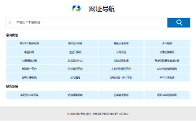

# CyanNavi Themes for Typecho

### 简介

CyanNavi是一款简易的导航网站模板。

### 安装

- 下载此分支文件重命名为`CyanNavi`，上传至站点`/usr/themes/`，通过`控制台`->`外观`启用主题，在`设置外观`中做相关设置。

### 说明

- 主题通过在撰写文章界面，增加自定义字段的方式，实现简易网站导航所需数据。

- 各个导航网站所属分类，需提前在`后台-管理-分类`界面设置。

- 每篇文章只能填一个需要导航的网站，即一篇文章为一个导航网站数据。

### 功能

##### 撰写文章界面

- 标题，填入导航网站名称，每篇文章只能填一个需要导航的网站。

- 分类，选择网站所属分类，可多选，需提前在`后台-管理-分类`界面设置。

- 正文，不填写。

###### 自定义字段

- 网址，在这里填入网址。

- 网站LOGO，在这里填入网站logo地址，建议大小20x20px。

- 网站简介，在这里填入网站的简介。

- 自定义数据，该项用于用户自定义数据扩展，可根据自己需求使用。

##### 主题设置

- 站点LOGO地址设置

填入一个图片URL地址, 作为网站LOGO，留空则直接显示站点文字标题。

- 站点副标题

填入一段文字，作为站点副标题和主标题一起显示在浏览器标题栏。

- ICP备案号

填入你的ICP备案号，显示在页脚。

- 站点统计

填入你的站点统计代码，例如百度统计。

- 导航分类隐藏设置

在这里填入你要隐藏的导航分类的分类缩略名{slug} ，例如tech。隐藏多个分类请使用英文逗号(,)分隔,例如 `tech,life,dream`

- 顶栏公告

填入一段文字，作为欢迎语或者公告显示在顶栏

- 顶栏显示

- [x] 显示登录入口
- [x] 显示顶栏公告

同时不选可隐藏顶栏

### 许可

MIT License